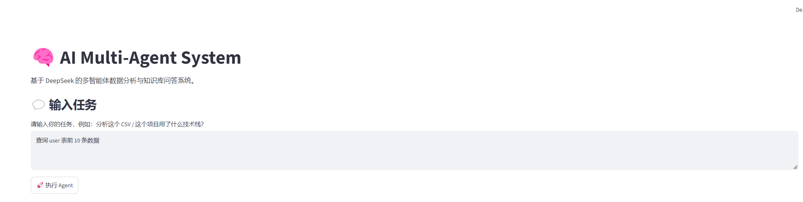
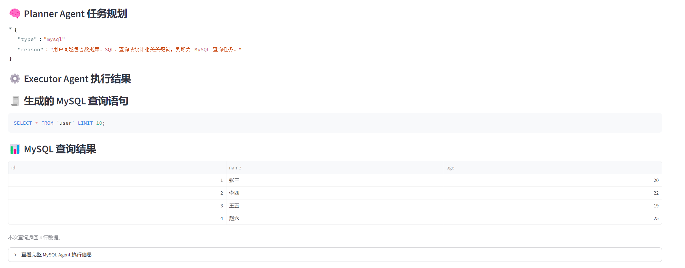
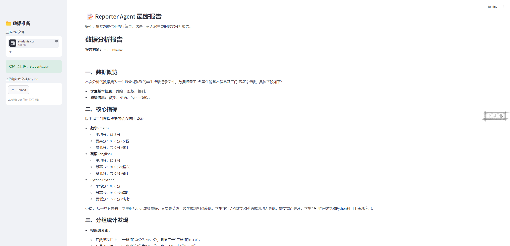

# AI Multi-Agent Data & RAG System

## 项目简介

本项目是一个基于 DeepSeek API 的 Multi-Agent 智能数据分析系统，融合了 CSV 数据分析、RAG 知识库问答和 MySQL 自然语言查询能力。

系统支持用户通过自然语言输入任务，由 Planner Agent 自动判断任务类型，再由 Executor Agent 调用对应工具完成数据分析、知识库检索或数据库查询，最后通过 Critic Agent 进行结果评审，并由 Reporter Agent 生成结构化分析报告。

本项目的核心目标是：让用户不用手写代码，也可以完成数据分析、文档问答和数据库查询任务。

---

## 项目截图

### 系统首页



### MySQL 自然语言查询



### CSV 数据分析报告



---

## 核心功能

* CSV 文件上传与自动分析
* 自动识别数值列和分类列
* 基础统计分析与分组聚合分析
* Matplotlib 自动生成可视化图表
* RAG 本地知识库问答
* ChromaDB 向量数据库检索
* MySQL 自然语言查询
* 自动生成 MySQL SELECT 查询语句
* SQL 安全校验，只允许执行 SELECT 查询
* Critic Agent 结果评审
* Reporter Agent 自动生成分析报告
* Streamlit 网页端交互展示
* HTML 报告下载

---

## 技术栈

* Python
* DeepSeek API
* Streamlit
* Pandas
* Matplotlib
* MySQL
* PyMySQL
* ChromaDB
* Sentence Transformers
* RAG
* Multi-Agent

---

## 系统架构

```text
用户输入任务
    ↓
Planner Agent
判断任务类型：CSV / RAG / MySQL / Chat
    ↓
Executor Agent
调用对应工具执行任务
    ↓
CSV Tool / RAG Tool / MySQL Tool
完成数据分析、知识检索或数据库查询
    ↓
Critic Agent
检查结果是否合理
    ↓
Reporter Agent
生成最终结构化报告
    ↓
Streamlit 页面展示
```

---

## Agent 模块说明

### Planner Agent

负责理解用户输入，并判断任务类型。

支持任务类型：

* `csv`：CSV 文件分析
* `rag`：知识库问答
* `mysql`：MySQL 数据库查询
* `chat`：普通对话

### Executor Agent

负责根据 Planner Agent 的规划结果调用对应工具。

例如：

* CSV 任务调用 Pandas 和 Matplotlib
* RAG 任务调用 ChromaDB 和 Embedding 检索
* MySQL 任务调用 PyMySQL 执行数据库查询

### Critic Agent

负责检查执行结果是否合理、清晰，并给出改进建议。

### Reporter Agent

负责将工具执行结果整理成结构化中文报告，适合用于展示和下载。

---

## MySQL Agent 说明

MySQL Agent 支持根据自然语言问题自动生成 MySQL 查询语句。

示例问题：

```text
查询 user 表前 10 条数据
统计 user 表中用户数量
查询 user 表中年龄最大的用户
查询年龄大于 20 岁的用户
```

系统会自动完成：

```text
自然语言问题
    ↓
读取 MySQL 表结构
    ↓
DeepSeek 生成 SELECT SQL
    ↓
SQL 安全检查
    ↓
执行 MySQL 查询
    ↓
返回查询结果并生成报告
```

为了安全，系统只允许执行 `SELECT` 查询，禁止 `INSERT`、`UPDATE`、`DELETE`、`DROP` 等危险 SQL 操作。

---

## RAG 知识库问答说明

RAG 模块支持上传本地 txt 或 md 文档。

系统会将文档切分为多个 chunk，并使用 Sentence Transformers 生成向量表示，再存入 ChromaDB 向量数据库。

用户提问时，系统会先从知识库中检索相关资料片段，再将检索结果交给 DeepSeek 生成回答，减少大模型幻觉，提高回答可靠性。

---

## CSV 数据分析说明

CSV 分析模块支持用户上传 CSV 文件，系统会自动：

* 读取 CSV 数据
* 识别数值列和分类列
* 计算数量、总和、平均值、最大值、最小值
* 按分类字段进行分组聚合
* 生成柱状图
* 调用 DeepSeek 生成中文数据分析报告
* 支持导出 HTML 报告

---

## 项目结构

```text
AI-Agent-Data-RAG-System/
│
├── app.py
├── README.md
├── requirements.txt
├── .env.example
├── .gitignore
│
├── agent/
│   ├── planner.py
│   ├── executor.py
│   ├── critic.py
│   └── reporter.py
│
├── tools/
│   ├── csv_analyzer.py
│   ├── rag_tool.py
│   └── mysql_tool.py
│
├── rag/
│   └── vector_store.py
│
├── data/
│   ├── sales.csv
│   └── project_intro.txt
│
├── assets/
│   ├── home.png
│   ├── mysql_result.png
│   └── csv_report.png
│
└── archive/
```

---

## 本地运行方式

### 1. 克隆项目

```bash
git clone https://github.com/hajimiOOO/AI-Agent-Data-RAG-System-.git
cd AI-Agent-Data-RAG-System-
```

### 2. 安装依赖

```bash
pip install -r requirements.txt
```

### 3. 配置环境变量

复制 `.env.example` 为 `.env`，并填写：

```env
DEEPSEEK_API_KEY=your_deepseek_api_key_here

MYSQL_HOST=localhost
MYSQL_PORT=3306
MYSQL_USER=root
MYSQL_PASSWORD=your_mysql_password_here
MYSQL_DATABASE=test
```

### 4. 启动项目

```bash
streamlit run app.py
```

---

## 项目亮点

* 使用 Multi-Agent 架构拆分任务规划、工具执行、结果评审和报告生成流程。
* 结合 LLM 与真实工具执行能力，实现大模型负责理解与生成，Python 工具负责真实计算和查询。
* 支持 CSV、RAG、MySQL 三类任务，覆盖数据分析常见场景。
* 实现 MySQL 自然语言查询能力，可以根据用户问题自动生成 SQL 并执行查询。
* 对 SQL 进行安全校验，只允许执行 SELECT 查询，避免危险数据库操作。
* 使用 RAG 技术实现本地知识库问答，提升回答可靠性。
* 使用 Streamlit 构建可视化交互页面，便于展示和部署。

---

## 后续优化方向

* 接入 LangGraph 实现更标准的 Agent 状态机工作流
* 支持 Excel 文件分析
* 支持更多数据库类型，例如 PostgreSQL、SQLite
* 增加多轮对话记忆
* 支持 PDF 报告导出
* 部署到云端并接入云数据库
* 增加用户权限和日志记录模块

---

## 项目总结

本项目完整实现了一个面向数据分析场景的 AI Agent 系统，融合了 LLM API 调用、RAG 检索增强、MySQL 自然语言查询、CSV 数据分析和 Multi-Agent 工作流。

项目适合用于展示 AI 应用开发、数据分析自动化、LLM + Tool Calling 和智能问答系统设计能力。
